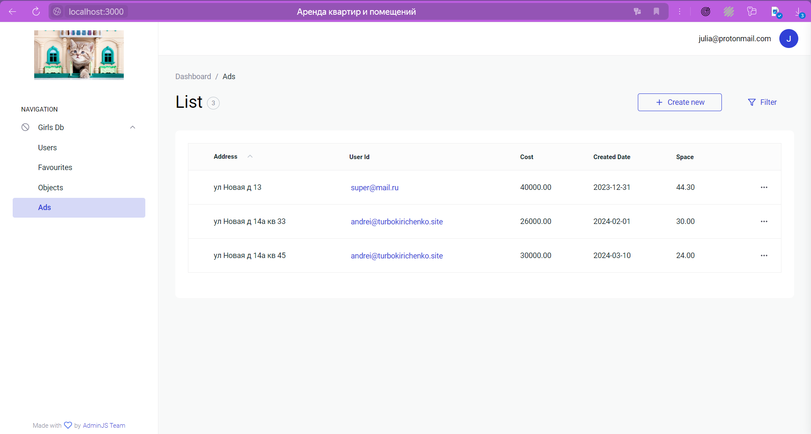

# Отчет о создании клиентского приложения

## (1) Страница логина пользователья

## (2) Страница аккаунта пользователя

> **Просьба учитвать, что в данном разделе у пользователя есть право на просмотр и изменение исключительно скоего аккаунта**

## (3) Изменение аккуанта

> **В изменении аккаунта пользователь не видит свой старый пароль**

## (4) Страница объявлений

## (5) Добавить объявление в избранное

## (6) Просмотр избранных

> **Избранное появляется только для конкретного пользователя, просмотр избранных у других пользователей закрыт**

## (7) Создание нового объявления

> **Также есть возможность создать и объект, привязка пользовательского айди осуществляется автоматически**

## (8) Применение Фильтра в таблице объектов

