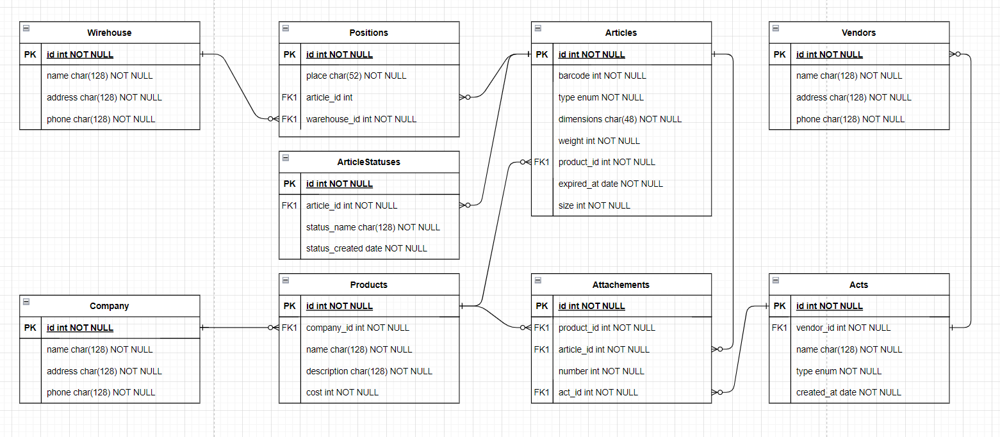

# Составление концептуальной модели диаграммы ER (вариант №07)

## (1) Текстуальный анализ

| Сущность - кандидат | Кол-во |
| ------------------- | ------ |
| Товар               | 59     |
| Расположение        | 13     |
| Акт                 | 8      |
| Поставщик           | 12     |
| Склад               | 18     |
| Покупатель          | 13     |

## (2) Ключевые сущности предметной области

| Название              |
| --------------------- |
| Товар                 |
| Расположение товара   |
| Акт (приема/передачи) |
| Вендор, Покупатель    |
| Склад                 |
| Администратор         |

## (3) Определение ассоциаций между сущностями

**Вендор** - создает -> **акт**

**Товар** - имеет уникальное -> **расположение**

**Покупатель** - формирует -> **акт приема**

**Администратор** - подтверждает -> **акт** приема/передачи

**Администратор** (Программа) - создает -> **товар**

**Расположение товара** - находится -> на **складе**

## (4) Глоссарий проекта

| Название            | Имя        | Описание                                                     |
| ------------------- | ---------- | ------------------------------------------------------------ |
| Товар               | Articles   | Единица физического товара                                   |
| Расположение Товара | Positions  | Уникальное расположение товара на складе                     |
| Поставщик           | Vendors    | Поставщик или Перевозчик товаров                             |
| Администратор       | Admins     | Внешняя сущность для управления сущностями БД                |
| Склад               | Wirehouses | Склад содержит все промежуточные товары на уникальном положении |
| Акт                 | Acts       | Акт приема/передачи                                          |

## (5) Начальная ER модель

## (6) Диаграммы информационных объектов

 