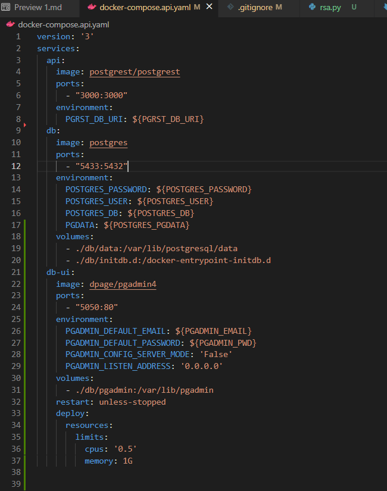
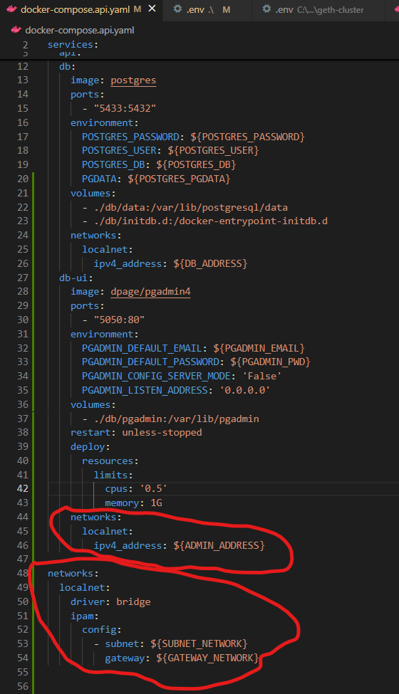
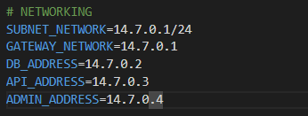
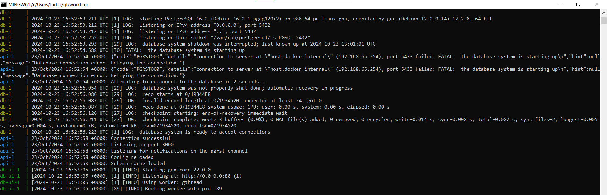
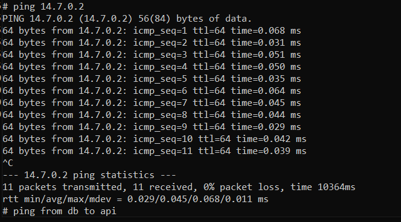
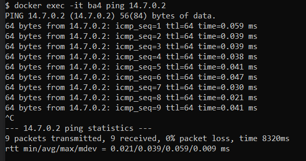
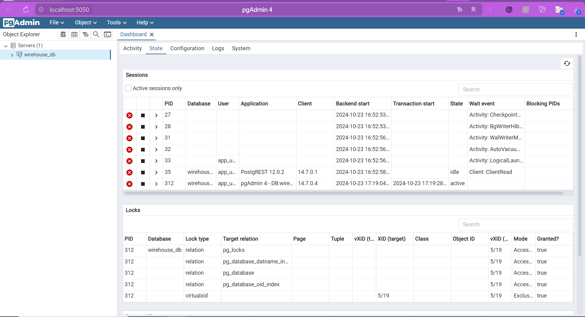

# Задание 3

## Разметка директорий

```
\-- apps
    \-- client
    \-- server
\-- db
    \-- data
    \-- initdb.d
    \-- pgadmin
\-- environments
    \-- dev
    \-- prod
\-- reports
    +-- report1.md
    +-- report2.md
    +-- report3.md
    +-- report4.md
+-- .env
+-- .gitignore
+-- docker-compose.api.yaml
+-- README.md
```

## Конфиг контейнеров

- **api**

  > доступ к базе данных через апи (веб клиент для всех пользователей)

- **db**

  > контейнер базы данных (сервер бд)

- **db-ui (pgAdmin4)**

  > веб панель администратора (клиент администратора бд)



## Настройка сети с помощью Docker

Для настройки сети мы используем драйвер локальной сети с режимом работы "bridge".

> В качестве моста выбран ip_address = **14.7.0.1** \
> В качестве маски сети ip_address = **14.7.0.0/24** \
> local_ip_address API = **14.7.0.3** \
> local_ip_address DB = **14.7.0.2** \
> locla_ip_address pgAdmin = **14.7.0.4**




## Проверка работоспособности кластера

> запуск контейнеров
> 
> ping с сервера на апи
> 
> ping с апи на сервер
> 

## Подключение pgAdmin к серверу


