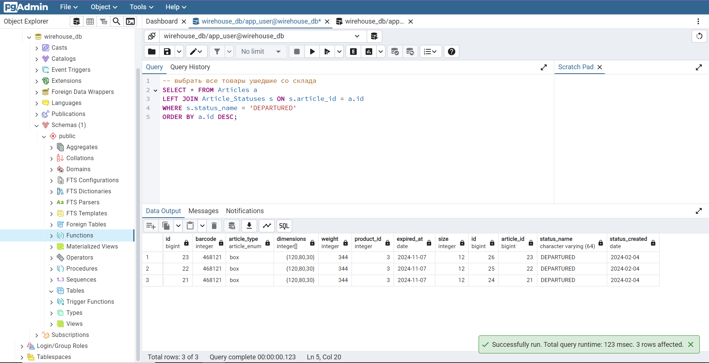
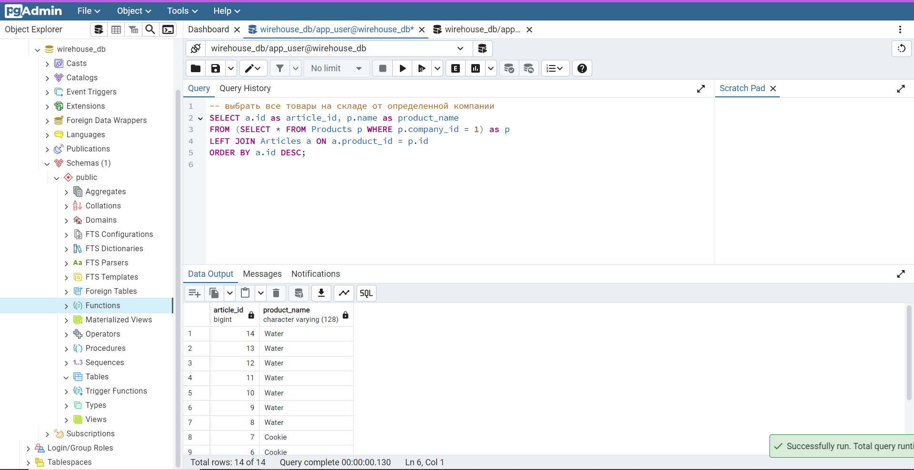
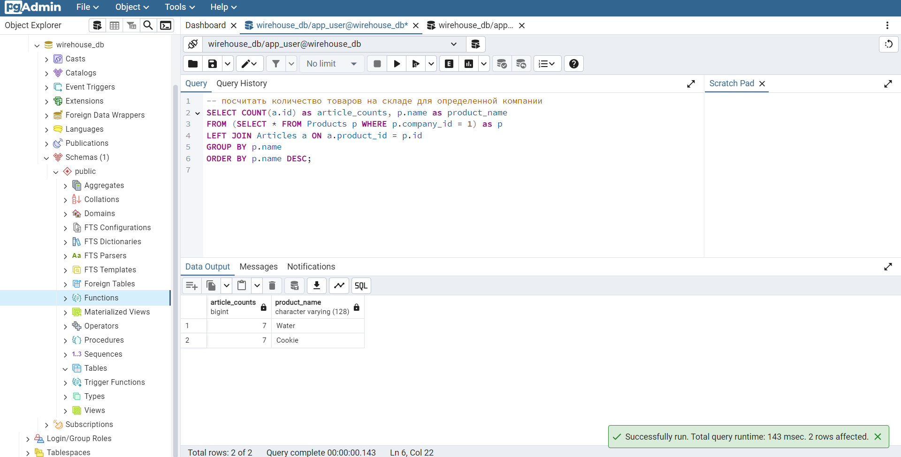
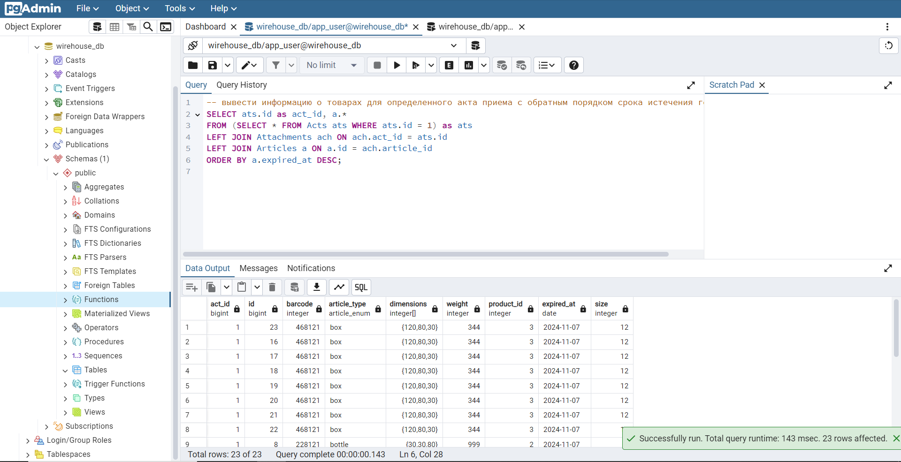
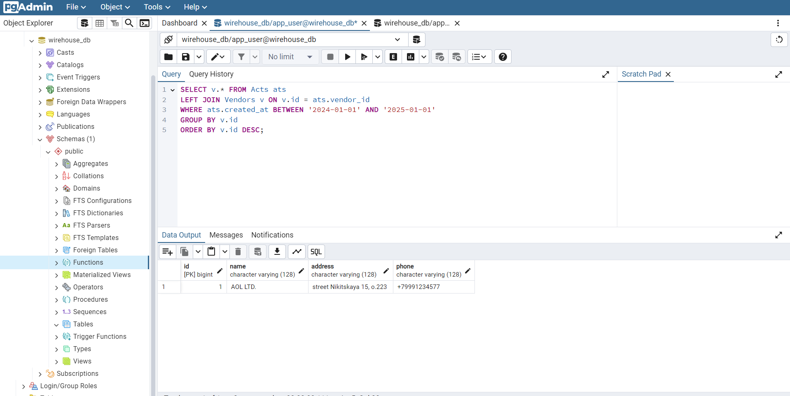

# Задание 4 (вариант 07)

1. были созданы таблицы и обозначены связи
2. были заполнены данные командой **INSERT INTO TB (...) VALUES (...)**
3. примеры агрегатных и функциональных запросов к заполненной базе данных
   
   
   
   
   
