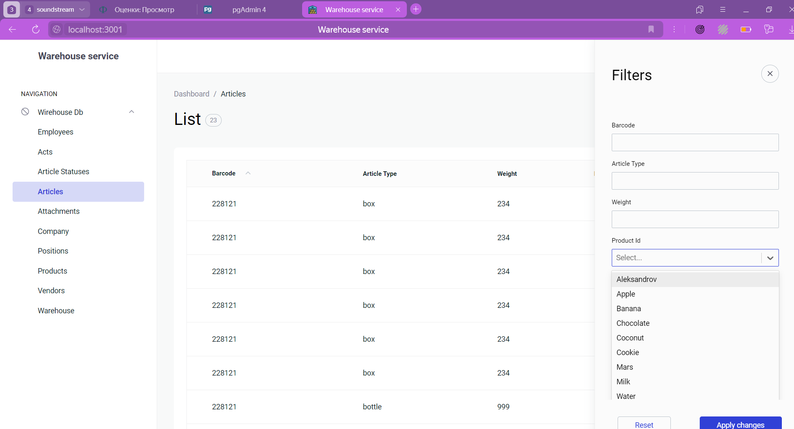
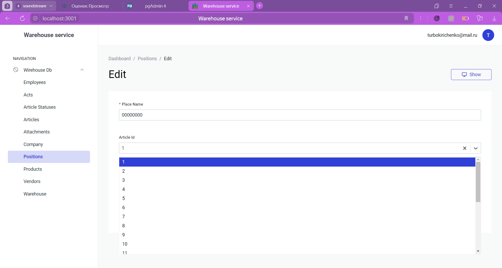

# Настройка MVP Клиента

---

## (0) Построение задачи

### Приведем список требований к MVP и на основе этих требований опишем задачи:

1. Понятный Интерфейс
2. Процесс авторизации и аутентификации клиента
3. Разделение политики доступа для клиентов
   - **select only** для всех таблиц,
   - **insert** для таблиц: Acts, Attachments, Articles, Article_Statuses
   - **partial update** для таблиц: Positions (добавит товар на конкретное место)
   - **select and update partial rows** для таблицы: Employees (клиент видит только свой аккаунт)
4. Возможность изменить данные клиента в личном кабинете

### Тогда, составим список задач

1. На основе библиотеки adminjs, развернуть базовое клиентское приложение подключенное к бд
2. Настроить базовый процесс авторизации и аутентификации
3. Разделить политики доступа для клиента
4. Добавить возможность редактирования личных данных для клиента
5. Протестировать функционал

## (1) Сборка клиента

```sh
# установка зависимстей
npm init
npm i adminjs express @adminjs/sql @adminjs/express @adminjs/themes

# добавление переменных окружения
touch .env
echo "PGRST_DB_URI='postgres://user:password@ip:port/db'\nPGRST_DB='db'" >> .env

mkdir src
touch index.js
touch src/bootstrap.js
```

### (2) Подключение к серверу базы данных

```js
// src/bootstrap.js
// ...
AdminJS.registerAdapter({
  Database,
  Resource,
})
export const bootstrap = async () => {
  const app = express()
  app.use(express.static(path.join(__dirname, "../public")));

  const db = await new Adapter('postgresql', {
    connectionString: PGRST_DB_URL,
    database: PGRST_DB,
  }).init()
// ...

// index.js
import { bootstrap } from './src/bootstrap.js'

bootstrap()
```

### (3) Вставка таблицы пользователей (работников)

```sql
CREATE TABLE IF NOT EXISTS Employees (
	id SERIAL PRIMARY KEY,
	name VARCHAR(64) NOT NULL,
	email VARCHAR(64) UNIQUE NOT NULL,
	phone VARCHAR(48) NOT NULL,
	password VARCHAR(128) NOT NULL
);
INSERT INTO Employees (name, email, phone, password, warehouse_id) VALUES
	('Andrey Kirichenko', 'turbokirichenko@mail.ru', '+79669808080', 'wsY0Xej44pFjm1tbHbv2BQ==.2mxTparWmb6+E9/gKJvuSnuoZgA='), -- passwrod = salt.hash(12345678)
	('Kirill Publichenko', 'republichenko@gmail.com', '+79996661499', '/huX0Ea4czTtTrgVhyuwVQ==.8zOa6UIFyhjoZS8v/2uYVo7gpPk='); -- password = salt.hash(republic12)
```

### (4) Аутенитификая

Процесс аутентификации:

1. клиента вводит email, password
2. система находит email в таблице Employees
3. система сравнивает validateHash(password, employee.password)
4. система выдает куки пользователю
5. при каждом запросе проверяется активность сессии

```js
// hash функции c HMAC, PADDING, salt
// src/hash

import crypto from "node:crypto";

/** hash algorithm */
const HASH_ALG = process.env.HASH_ALG ?? "sha1";

/** hash secret */
const PADDING = process.env.HASH_PAD ?? "";

/**
 *
 * @param {Buffer} salt
 * @param {string} str
 * @returns {Buffer}
 */
const createHash = (salt, str) => {
  const buff = Buffer.from(str, "utf8");
  const hmac = crypto.createHmac(HASH_ALG, PADDING);
  const leng = salt.length + buff.length;
  hmac.update(Buffer.concat([salt, buff], leng));
  return hmac.digest();
};

/**
 * @param {string} str
 * @returns {string}
 */
export const signHash = (str) => {
  const salt = crypto.randomBytes(16);
  const hash = createHash(salt, str);
  return `${salt.toString("base64")}.${hash.toString("base64")}`;
};

/**
 * @param {string} str
 * @param {string} hashStr
 * @returns {boolean}
 */
export const validateHash = (str, hashStr) => {
  const [salt, hash] = hashStr.split(".");
  const test = createHash(Buffer.from(salt, "base64"), str);
  const buff = Buffer.from(hash, "base64");
  return Buffer.compare(test, buff) === 0;
};
```

```js
// конфиг аутентификации
// src/config/admin.auth.js

authenticate: async (email, password) => {
  if (!email || !password) {
    return null;
  }
  const tryUser = await knex("employees")
    .select("id", "password")
    .where({ email: email })
    .first();
  if (!tryUser) {
    return null;
  }
  // проверка пароля
  const v = validateHash(password, tryUser.password);
  if (v) {
    return { id: tryUser.id, email };
  } else {
    return null;
  }
};
```

### (5) Запуск

```sh
node --env-file ./.env index.js
```

### (6) Настройка политики доступа

```js
// Для каждой таблицы прописываем ограничения

/** Пример конфига для таблицы Acts
 * @param {Adapter} __adapter
 */
export const actsResource = (__adapter) => ({
  resource: __adapter.table("acts"),
  options: {
    editProperties: ["name", "created_at"], // белый список редактирования
    properties: {
      id: {
        isVisible: false, // скрываем id
      },
    },
    actions: {
      bulkDelete: {
        isVisible: false, // запрет delete
        isAccessible: false,
      },
      delete: {
        isVisible: false, // запрет bulkDelete
        isAccessible: false,
      },
    },
  },
});

// и т.д. для кажой таблшицы
```

## (7) Проверка

### запуск


### логин и неправильный логин


### аккаунт пользователя


### акты


### создание акта

> процесс создания акта:
>
> 1. создание акта
> 2. создание приложение (attachments) для акта
> 3. активация акта


### товары и фильр товаров




### приложения


### компании


### изменение позиции товаров



## TODO

### 1. добавить роли для пользователей

### 2. добавить **транзакции** для создания актов
