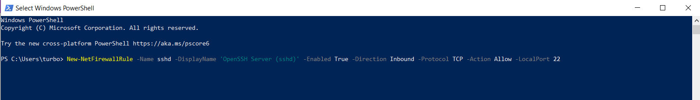
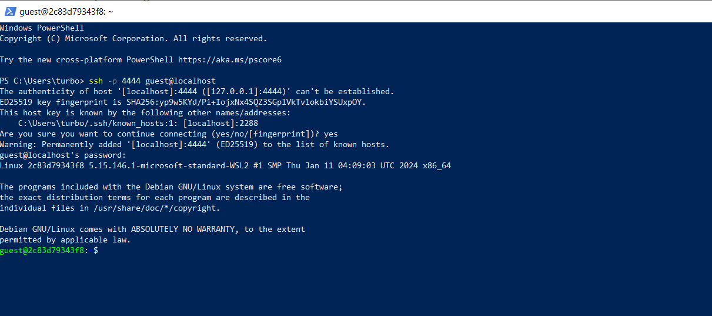
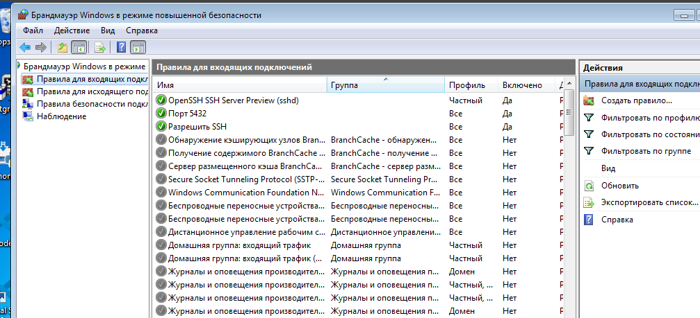
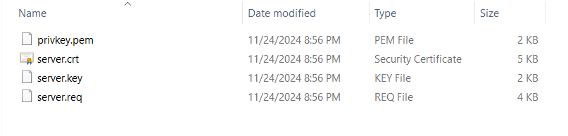
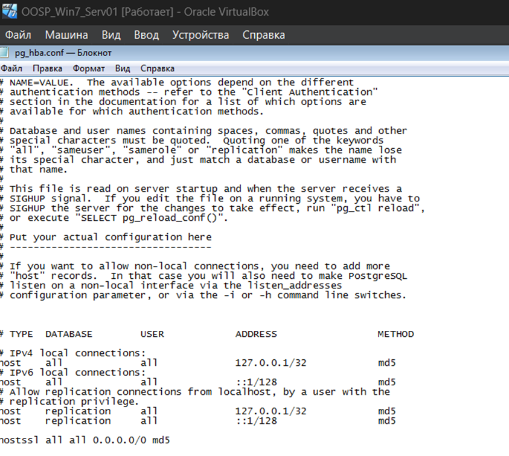
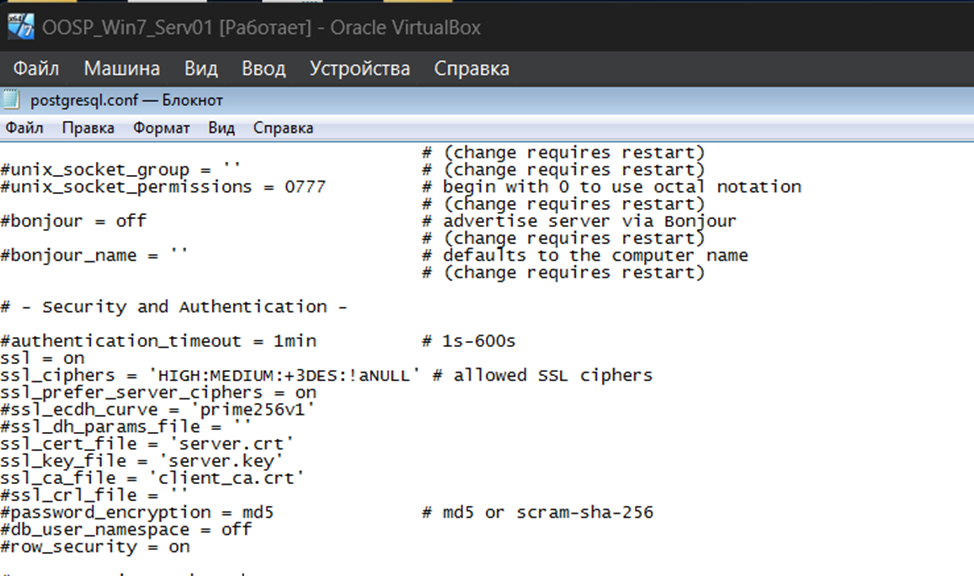
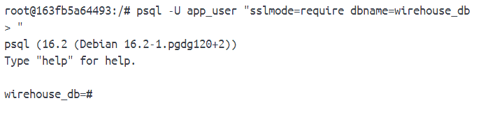
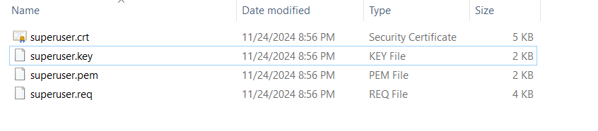

## Настройка SSH

### настройка файервола



### настройка соединения

```
net start sshd
```

### проверка



### сервер ssh



## Настройка SSL

### генерация ключей

> ключи можно сгенерировать следующими командами

```
# чтобы правильно отображать пути
MSYS_NO_PATHCONV=1

# генерируем основной ключ
openssl req -new -text -passout pass:12345678 -subj /C=Russia/CN=localhost -keyout privkey.pem -out server.req

# генерируем сертификат
openssl rsa -in privkey.pem -passin pass:12345678 -out server.key
openssl req -x509 -in server.req -text -key server.key -out server.crt
```

### ключи в папке



### настройка внешних соединений в pg_hba





### проверяем работу psql с сервера в защищенном режиме



### настройка клиента

> генерация клиентских ключей происходит подобным образом, только подписывается имя пользователя

```
# чтобы правильно отображать пути
MSYS_NO_PATHCONV=1

# генерируем основной ключ
openssl req -new -text -passout pass:12345678 -subj /C=Russia/CN=superuser -keyout superuser.pem -out superuser.req

# генерируем сертификат
openssl rsa -in privkey.pem -passin pass:12345678 -out superuser.key
openssl req -x509 -in superuser.req -text -key superuser.key -out superuser.crt
```

### проерка клиента



### подтверждение через ssh


