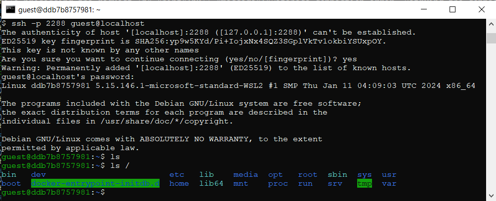
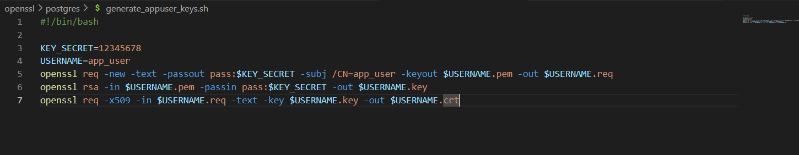

# Настройка SSL сертификатов

## OpenSSH

### (1) Enable SSH connection via db.Dockerfile

> составляем докерфайл, чтобы при загрузке образа запускалась возможность создавать ssh соединение напрямую с контейнером

### (2) Open port in docker compose

> открываем соответствующий порт в контейнере, остальные порты автоматически недоступны по политикам доступа Docker
> создаем специального пользователя для защищенной работы

### (3) Check ssh connection

> с клиентского окна подключаемся к сети контейнера через ssh

## Настройка SSL

### (4) Создаем pg_hba.conf

### (5) Создаем sh скрипт для генерации ключей сервера и клента

> генерация ключей сервера

> генерация ключей клиента

> [Важно]
> для генерации https соединения можно воспользоваться файлом для сервера

### (6) Генерируем ключи

### (7) Заполняем конфиги docker-compose

#### (7.1) для сервера

#### (7.2) для админки

### (8) Проверка ssl на сервере

### (9) Админ панель с самоподписным сертификатом

